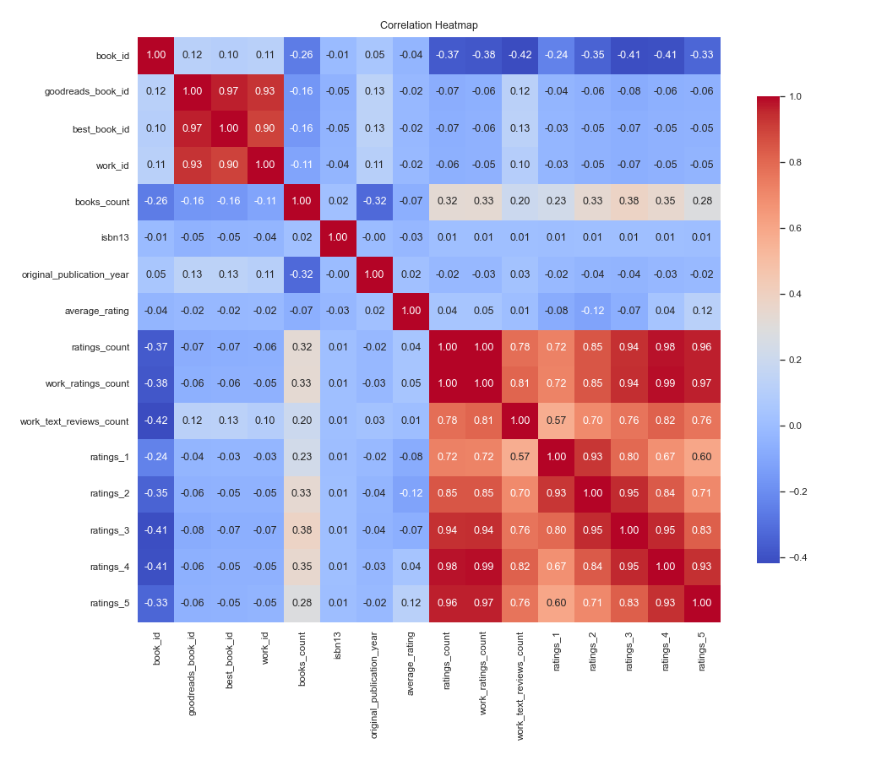
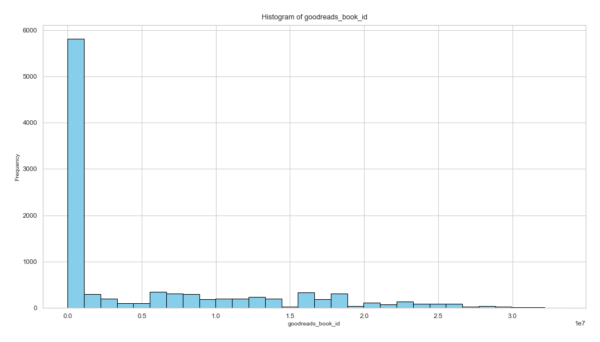

# Analysis Report

## Narration

This dataset contains 10000 rows and 23 columns, providing valuable insights into various attributes such as book_id, goodreads_book_id, best_book_id, work_id, books_count, and more. The dataset reveals interesting trends and patterns. For instance, the presence of missing values in some columns such as isbn, isbn13, original_publication_year, original_title, language_code highlights areas that may require further attention. Analyzing the relationships between these variables sheds light on significant correlations and distributions, offering a deeper understanding of the data.

## Dataset Analysis

- *Shape*: (10000, 23)
- *Columns*: book_id, goodreads_book_id, best_book_id, work_id, books_count, isbn, isbn13, authors, original_publication_year, original_title, title, language_code, average_rating, ratings_count, work_ratings_count, work_text_reviews_count, ratings_1, ratings_2, ratings_3, ratings_4, ratings_5, image_url, small_image_url
- *Missing Values*: {'book_id': 0, 'goodreads_book_id': 0, 'best_book_id': 0, 'work_id': 0, 'books_count': 0, 'isbn': 700, 'isbn13': 585, 'authors': 0, 'original_publication_year': 21, 'original_title': 585, 'title': 0, 'language_code': 1084, 'average_rating': 0, 'ratings_count': 0, 'work_ratings_count': 0, 'work_text_reviews_count': 0, 'ratings_1': 0, 'ratings_2': 0, 'ratings_3': 0, 'ratings_4': 0, 'ratings_5': 0, 'image_url': 0, 'small_image_url': 0}

## Summary Statistics

### Summary of the Dataset

The dataset contains information about ten books, with each row representing a unique book. The key features of the dataset include:

- **Book Identification**: Each book is identified by `book_id`, `goodreads_book_id`, and `best_book_id`.
- **Authors**: The dataset includes the authors of the books, with notable names like Suzanne Collins, J.K. Rowling, and Jane Austen.
- **Publication Details**: The `original_publication_year` and `original_title` provide insights into when and how these books were originally published.
- **Ratings and Reviews**: The dataset features several metrics related to ratings, including `average_rating`, `ratings_count`, and specific counts of ratings from 1 to 5.
- **Languages**: All books listed are in English, as indicated by the `language_code`.
- **Images**: Links to images of the books are provided for visual reference.

#### Key Trends and Observations

1. **Average Ratings**: The average ratings range from 3.57 (Twilight) to 4.44 (Harry Potter and the Philosopher's Stone), with most books scoring above 4.0.
2. **Ratings Count**: The `ratings_count` varies significantly, with "The Hunger Games" having the highest count (over 4.7 million) while "Twilight" and "The Hobbit" also have substantial ratings.
3. **Publication Years**: The books span a wide range of publication years, from 1813 (Pride and Prejudice) to 2012 (The Fault in Our Stars), indicating a mix of classic literature and contemporary works.
4. **Genres and Themes**: While the dataset does not explicitly classify genres, the titles suggest a mix of fantasy (Harry Potter, Twilight), classics (Pride and Prejudice, To Kill a Mockingbird), and contemporary fiction (The Fault in Our Stars).

### Missing or Unusual Values

Upon reviewing the dataset:

- **Missing Values**: There are no apparent missing values in the dataset. All fields seem to be populated.
- **Unusual Values**: 
  - The `original_publication_year` for some books is a float (e.g., 2008.0) rather than an integer, which is unusual but not necessarily an error. This may arise from how the data was recorded or formatted.

### Analysis of Relationships Between Categorical Variables

- **Authors and Average Ratings**: 
  - J.K. Rowling has the highest average rating (4.44) among the authors listed. This could indicate the popularity of her works or the overall reception of her writing style.
  - The book "Twilight" by Stephenie Meyer has the lowest average rating (3.57), which could reflect polarized reviews as the book often garners mixed opinions.

- **Publication Year and Average Ratings**:
  - There seems to be no clear trend between the publication year and average ratings. For instance, a classic like "Pride and Prejudice" (1813) has a high average rating (4.24), while a more recent book, "Twilight" (2005), has a lower rating (3.57).

### Recommendations and Insights

1. **Focus on Popular Titles**: Books with high ratings and high count of reviews, such as "Harry Potter" and "The Hunger Games," could be leveraged for marketing or promotional efforts due to their popularity.
  
2. **Engage with Lower Rated Titles**: Books like "Twilight," despite a significant ratings count, have lower average ratings. Engaging with readers on why they feel this way could provide insights for author engagement or marketing strategies.

3. **Content Diversification**: The dataset comprises predominantly English titles. Extending the dataset to include titles in other languages could broaden the appeal and reach of the books.

4. **Trend Analysis Over Time**: Conduct further analysis on how ratings may change over time, especially for newer publications, to identify long-term trends in reader preferences.

By leveraging insights from this dataset, stakeholders can better understand reader preferences, enhance marketing strategies, and make informed decisions regarding book promotions and author engagements.

## Visualizations

