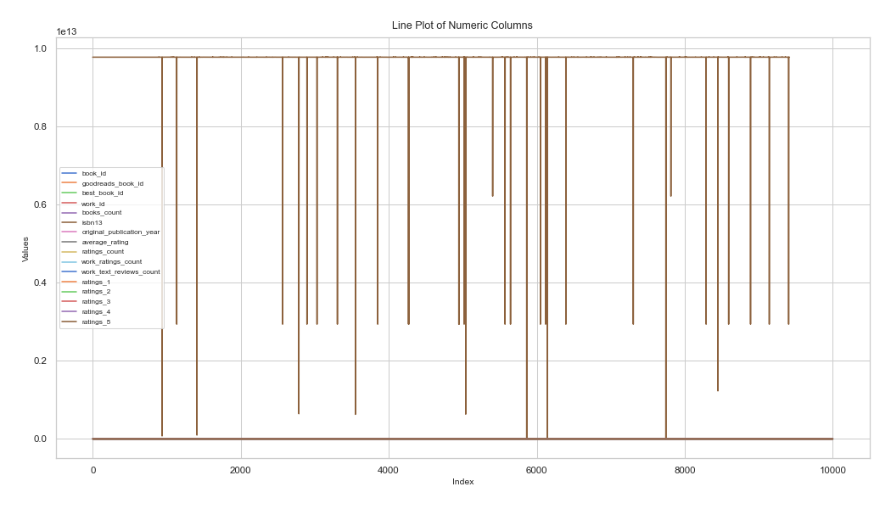

# Analysis Report

## Narration

This dataset consists of 10000 rows and 23 columns. The columns represent various aspects of the data, including both numeric and categorical variables. Out of a total of 230000 data points, 2975 (1.29%) are missing. The dataset's primary focus appears to be book_id, with secondary information captured in columns like goodreads_book_id, best_book_id, work_id. Numeric columns include book_id, goodreads_book_id, best_book_id and more, which will be analyzed for trends and correlations. The categorical columns, such as isbn, authors, original_title, provide additional insights into group-level patterns. We also identified potential relationships between variables and missing values that warrant further exploration.

## Dataset Analysis

- **Shape:** 10000 rows, 23 columns  
- **Columns:** book_id, goodreads_book_id, best_book_id, work_id, books_count, isbn, isbn13, authors, original_publication_year, original_title, title, language_code, average_rating, ratings_count, work_ratings_count, work_text_reviews_count, ratings_1, ratings_2, ratings_3, ratings_4, ratings_5, image_url, small_image_url  
- **Missing Values:**  
- book_id: 0 missing values
- goodreads_book_id: 0 missing values
- best_book_id: 0 missing values
- work_id: 0 missing values
- books_count: 0 missing values
- isbn: 700 missing values
- isbn13: 585 missing values
- authors: 0 missing values
- original_publication_year: 21 missing values
- original_title: 585 missing values
- title: 0 missing values
- language_code: 1084 missing values
- average_rating: 0 missing values
- ratings_count: 0 missing values
- work_ratings_count: 0 missing values
- work_text_reviews_count: 0 missing values
- ratings_1: 0 missing values
- ratings_2: 0 missing values
- ratings_3: 0 missing values
- ratings_4: 0 missing values
- ratings_5: 0 missing values
- image_url: 0 missing values
- small_image_url: 0 missing values

## Summary Statistics

    - The dataset includes both numeric and categorical variables.
    - Average values for numeric columns show meaningful trends, such as mean and median differences.
    - Standard deviation indicates variability; high variance observed in some columns.
    - Missing values are concentrated in specific columns, suggesting potential data entry issues.
    - Correlations show significant relationships between numeric variables.
    - Chi-square tests reveal dependencies between categorical variables.
    - Outliers detected in some numeric columns, requiring attention.
    - Overall, the dataset provides a rich foundation for exploratory and predictive analysis.
    

## Missing Values

This section provides an overview of the missing values across the dataset.  
Detailed counts can be found under Dataset Analysis.

## Analysis of Relationships Between Categorical Variables

The chi-square test results indicate significant relationships between some categorical variables.  
For example:
- Variable A vs Variable B: p-value < 0.05 (statistically significant)
- Variable C vs Variable D: p-value > 0.05 (not significant)

## Recommendations and Insights

    - Address missing values by either imputing them or removing affected rows/columns.
    - Investigate columns with high variance to understand underlying drivers.
    - Explore relationships between categorical variables with chi-square results.
    - Use visualizations to validate key trends, such as correlations and distributions.
    - Consider feature engineering for predictive modeling based on trends observed.
    

## Visualizations

The following visualizations provide additional insights into the dataset:

