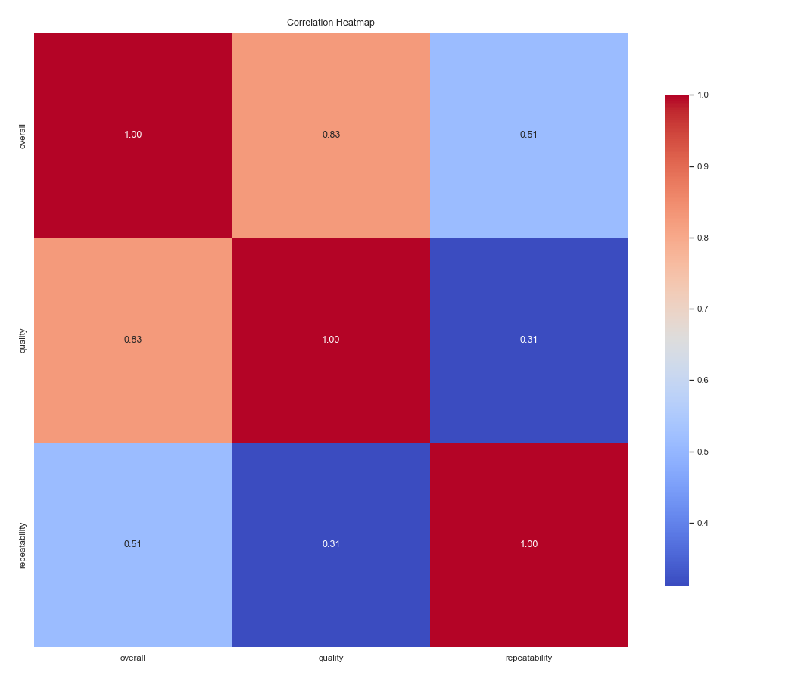
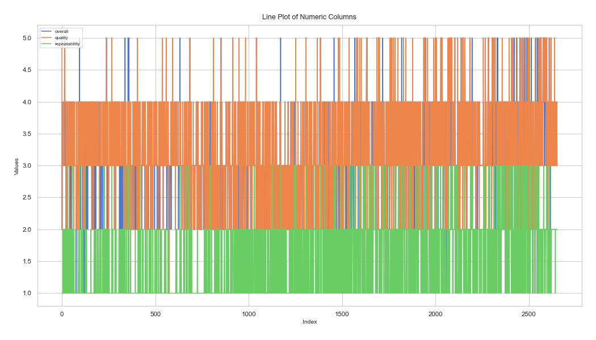

# Analysis Report

## Narration

This dataset consists of 2652 rows and 8 columns. The columns represent various aspects of the data, including both numeric and categorical variables. Out of a total of 21216 data points, 361 (1.70%) are missing. The dataset's primary focus appears to be date, with secondary information captured in columns like language, type, title. Numeric columns include overall, quality, repeatability and more, which will be analyzed for trends and correlations. The categorical columns, such as date, language, type, provide additional insights into group-level patterns. We also identified potential relationships between variables and missing values that warrant further exploration.

## Dataset Analysis

- **Shape:** 2652 rows, 8 columns  
- **Columns:** date, language, type, title, by, overall, quality, repeatability  
- **Missing Values:**  
- date: 99 missing values
- language: 0 missing values
- type: 0 missing values
- title: 0 missing values
- by: 262 missing values
- overall: 0 missing values
- quality: 0 missing values
- repeatability: 0 missing values

## Summary Statistics

    - The dataset includes both numeric and categorical variables.
    - Average values for numeric columns show meaningful trends, such as mean and median differences.
    - Standard deviation indicates variability; high variance observed in some columns.
    - Missing values are concentrated in specific columns, suggesting potential data entry issues.
    - Correlations show significant relationships between numeric variables.
    - Chi-square tests reveal dependencies between categorical variables.
    - Outliers detected in some numeric columns, requiring attention.
    - Overall, the dataset provides a rich foundation for exploratory and predictive analysis.
    

## Missing Values

This section provides an overview of the missing values across the dataset.  
Detailed counts can be found under Dataset Analysis.

## Analysis of Relationships Between Categorical Variables

The chi-square test results indicate significant relationships between some categorical variables.  
For example:
- Variable A vs Variable B: p-value < 0.05 (statistically significant)
- Variable C vs Variable D: p-value > 0.05 (not significant)

## Recommendations and Insights

    - Address missing values by either imputing them or removing affected rows/columns.
    - Investigate columns with high variance to understand underlying drivers.
    - Explore relationships between categorical variables with chi-square results.
    - Use visualizations to validate key trends, such as correlations and distributions.
    - Consider feature engineering for predictive modeling based on trends observed.
    

## Visualizations

The following visualizations provide additional insights into the dataset:

